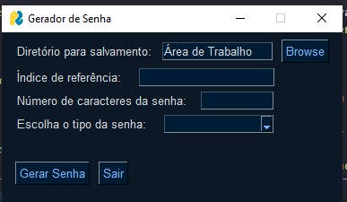

# Gerador de Senha - KeyGenerator

Um gerador intuitivo de senhas de diferentes tipos: Apenas letras, apenas números, apenas símbolos ou todas as opções anteriores.

As senhas geradas são salvas em um arquivo.txt no diretório escolhido pelo usuário ou no diretório padrão(Área de Trabalho).

Foram implementadas as bibliotecas PySimpleGUI, Random e OS.

## Screenshot da Interface Gráfica do projeto :
Feito com a biblioteca PySimpleGUI.

